# Create the cash Customer — User Manual (English)

Creating a new cash customer

Generated from an Odoo Tour Recorder export, replayed with Playwright, and screenshotted at every step.

> 4 recorded step(s) were excluded from the replay (fields/menus that no longer exist, or accidental trailing steps) — see REVIEW.md.

---

## 1. Click Sales Module

Click Sales Module

---

## 2. Orders

Click Orders

---

## 3. Customers

Click Customers

> **Note:** this step was adapted from the recorded tour — see REVIEW.md.

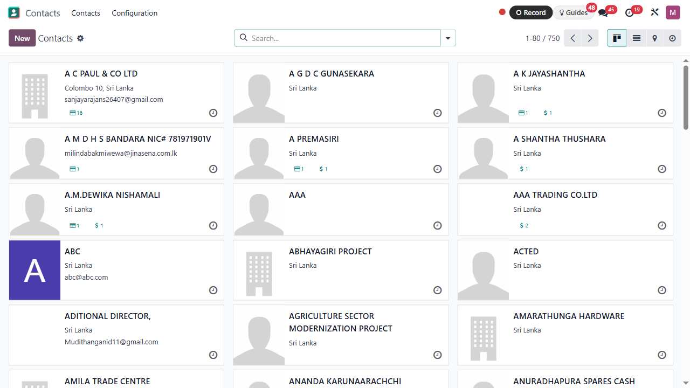

---

## 4. New

Click New

_Create a new customer_

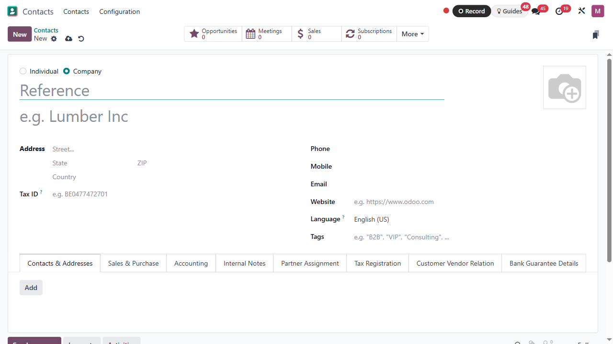

---

## 5. Individual

Company Type

_Click the Individual_

---

## 6. on

Click Individual

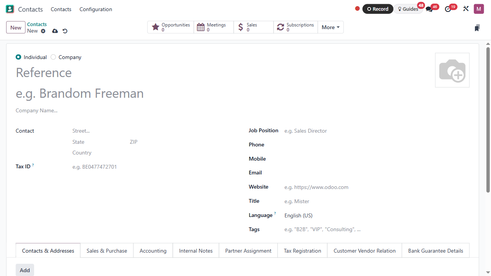

---

## 7. e.g. Brandom Freeman

e.g. Brandom Freeman

_Type the Customer Name_

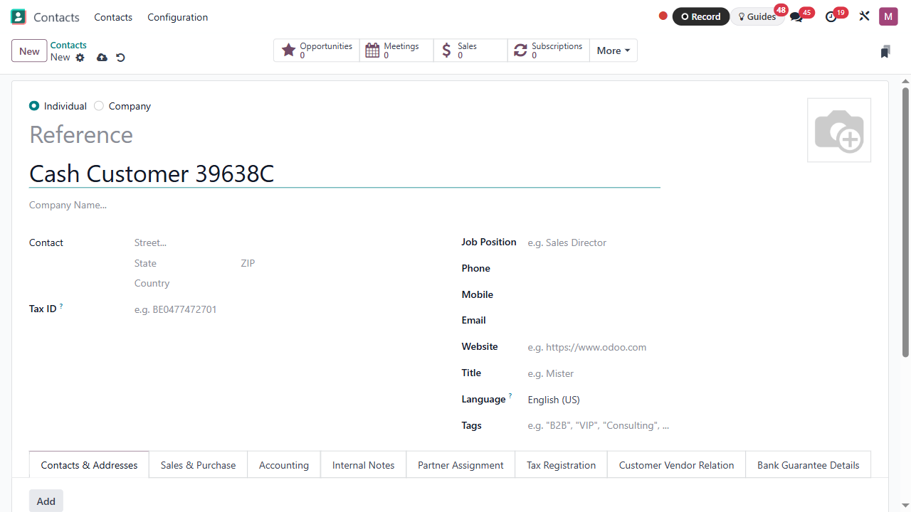

---

## 8. Street...

Street...

_Set the Address_

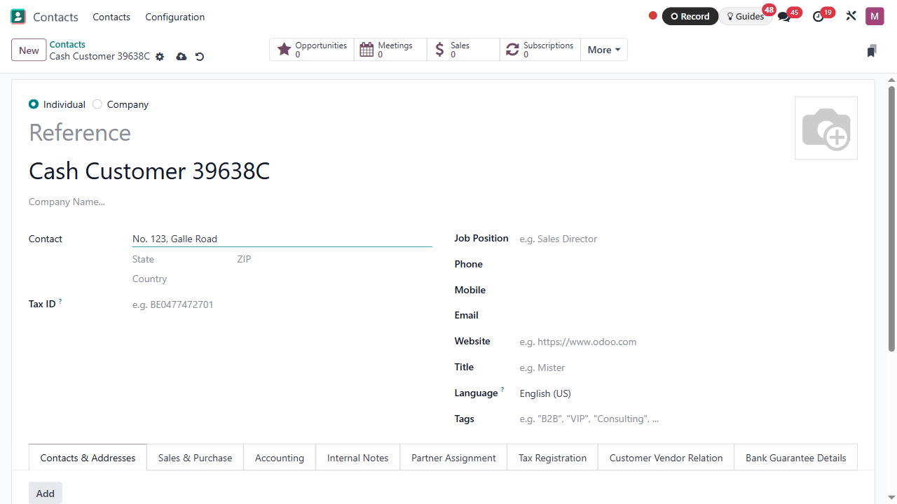

---

## 9. Sri Lanka

Country

_Set the Country_

> **Note:** this step was adapted from the recorded tour — see REVIEW.md.

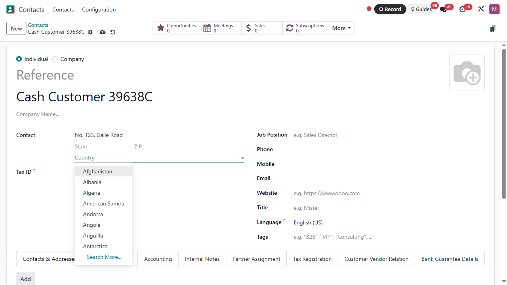

---

## 10. Search More...

_Click Search More_

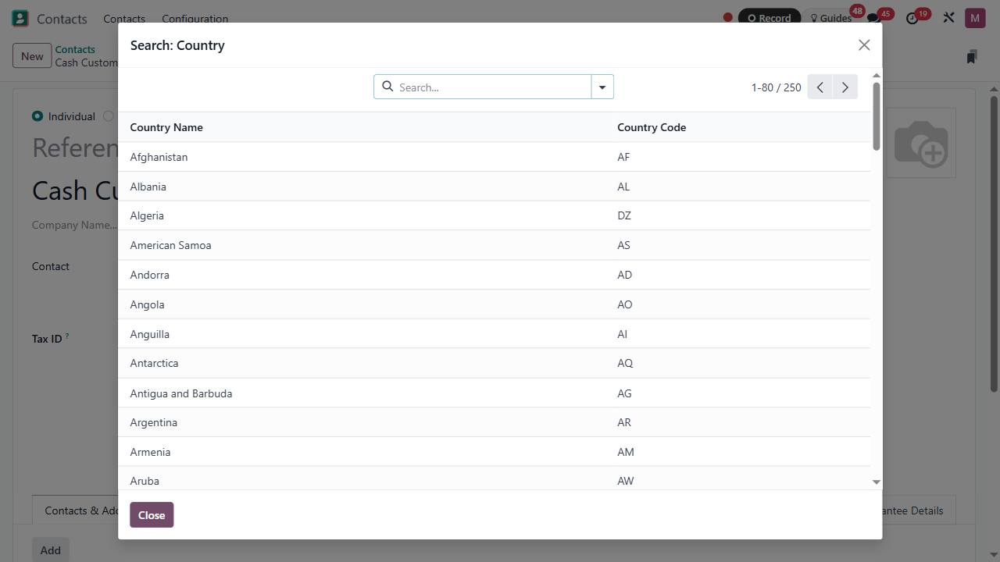

---

## 11. Sri Lanka

Sri Lanka

_Click Sri Lanka_

> **Note:** this step was adapted from the recorded tour — see REVIEW.md.

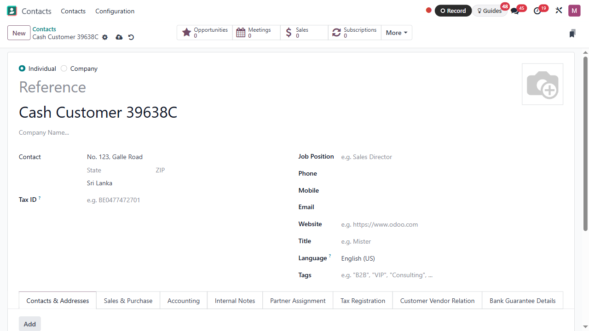

---

## 12. +94 711234569

_Set the phone number_

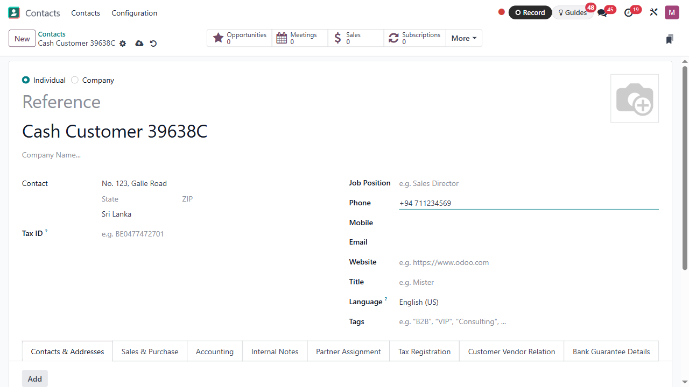

---

## 13. CDE@gmail.com

Send Email

_Set the mail address_

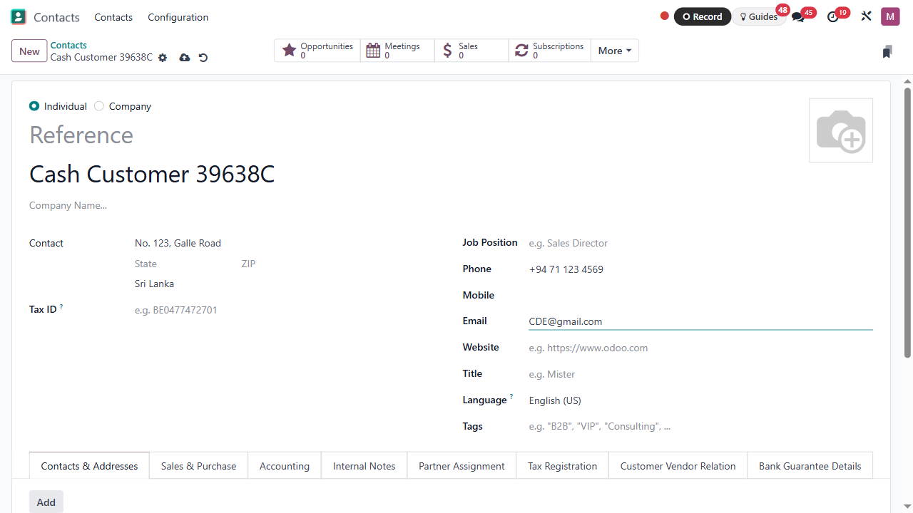

---

## 14. Sales & Purchase

_Click Sales & Purchase_

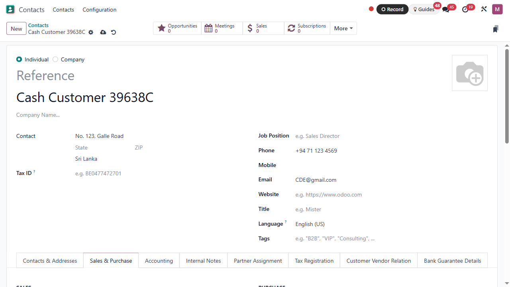

---

## 15. Immediate Payment

This payment term will be used instead of the default one for sales orders and customer invoices

_Click the drop down box_

> **Note:** this step was adapted from the recorded tour — see REVIEW.md.

---

## 16. Immediate Payment

This payment term will be used instead of the default one for sales orders and customer invoices

_Select Immediate Payment_

> **Note:** this step was adapted from the recorded tour — see REVIEW.md.

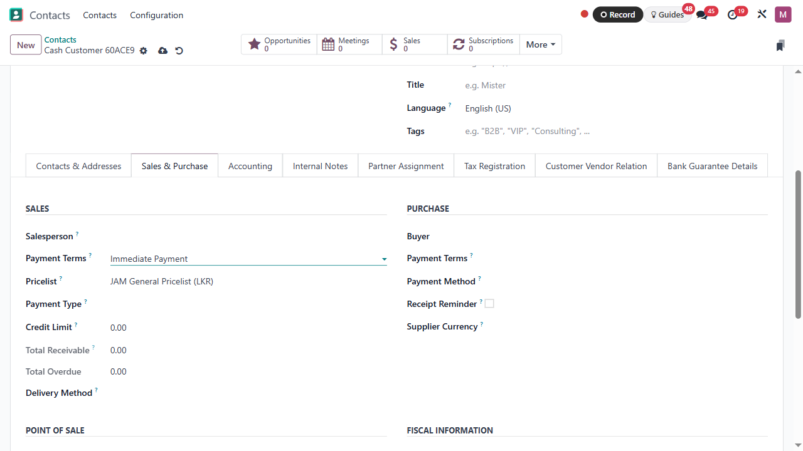

---

## 17. Cash Credit

Cash / Credit

_Click the Payment type_

> **Note:** this step was adapted from the recorded tour — see REVIEW.md.

---

## 18. Save manually

Save manually

_Click Save button_

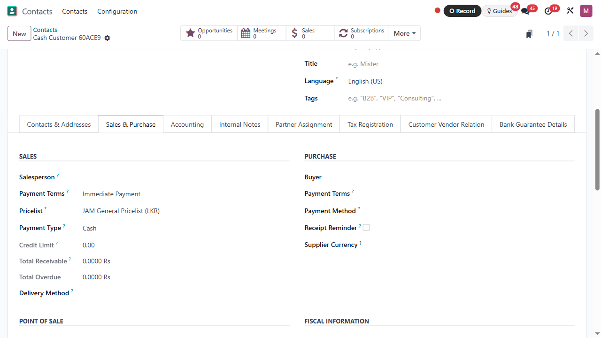

---

## 19. Customers

Back to “Customers”

_Click Customers_

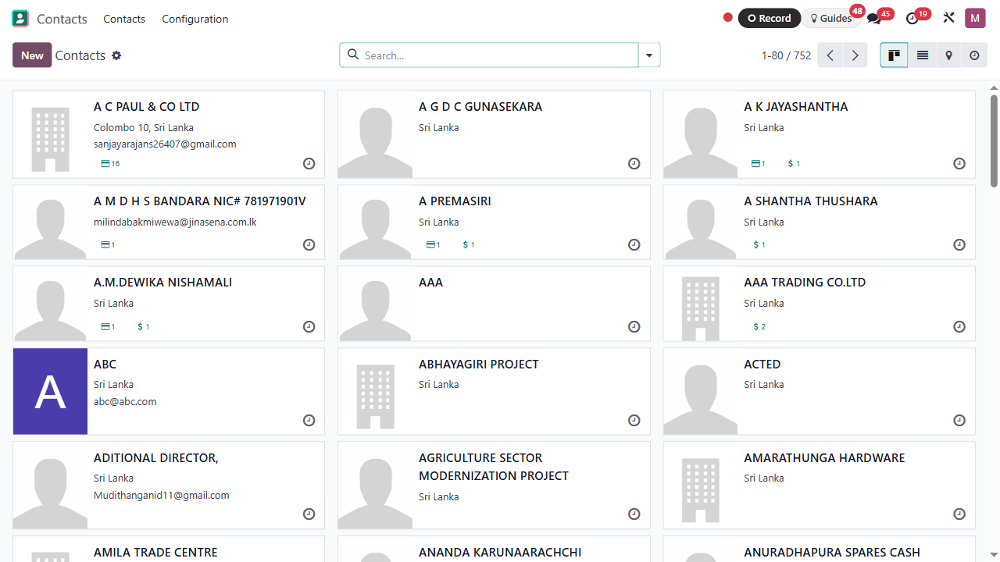

---

## 20. Remove

Remove

_Remove click_

---

## 21. Search...

Search...

_Search created customer_

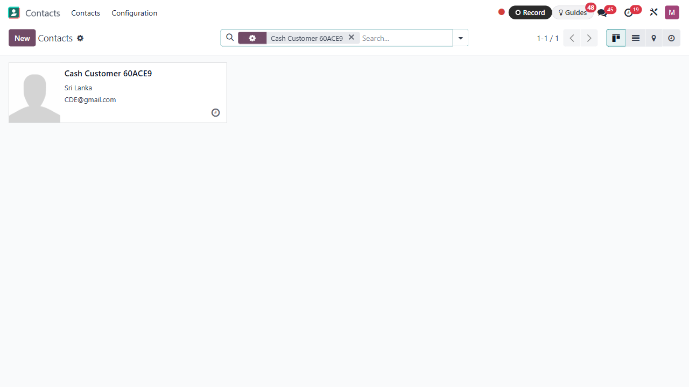

---

